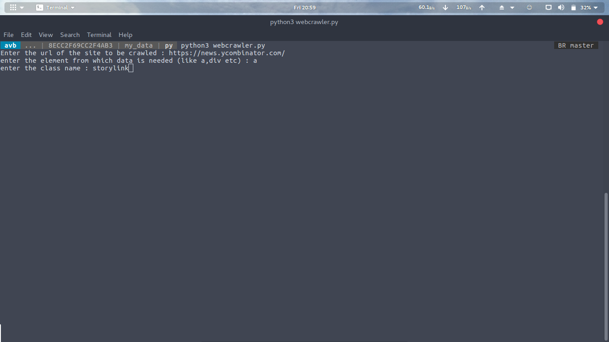
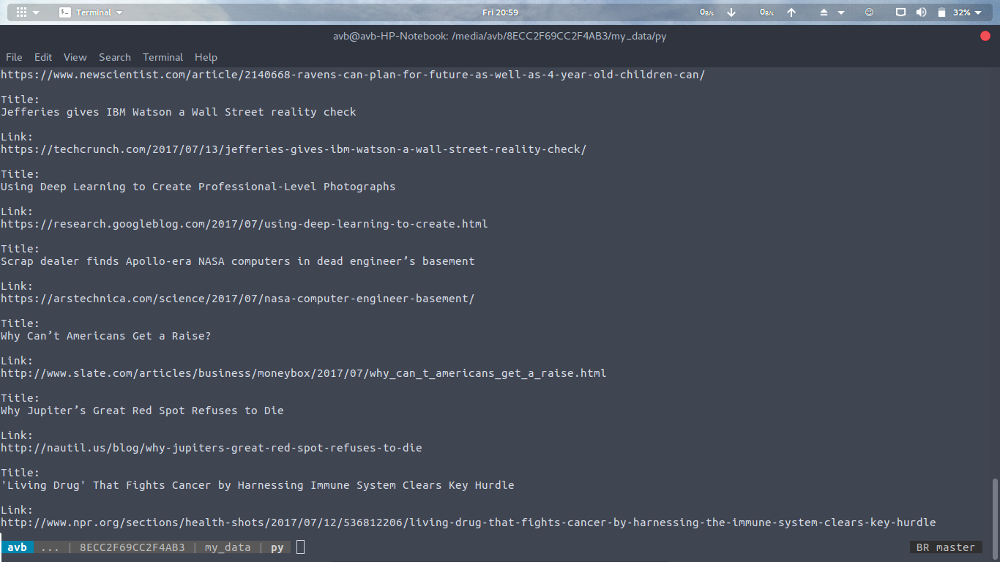

# Details
This is a webcrawler built using python.You just have to give the url and the element and class of the website where the content is present.The COntents Scraped will be saved to crawler.txt in the same folder!


# Installation

```sh
Install Python
$ pip install bs4
$ python webcrawler.py
enter the url
enter the element(eg: a,div) and the class 
enjoy 
The date will also be saved in crawler.txt
```

# Screens



